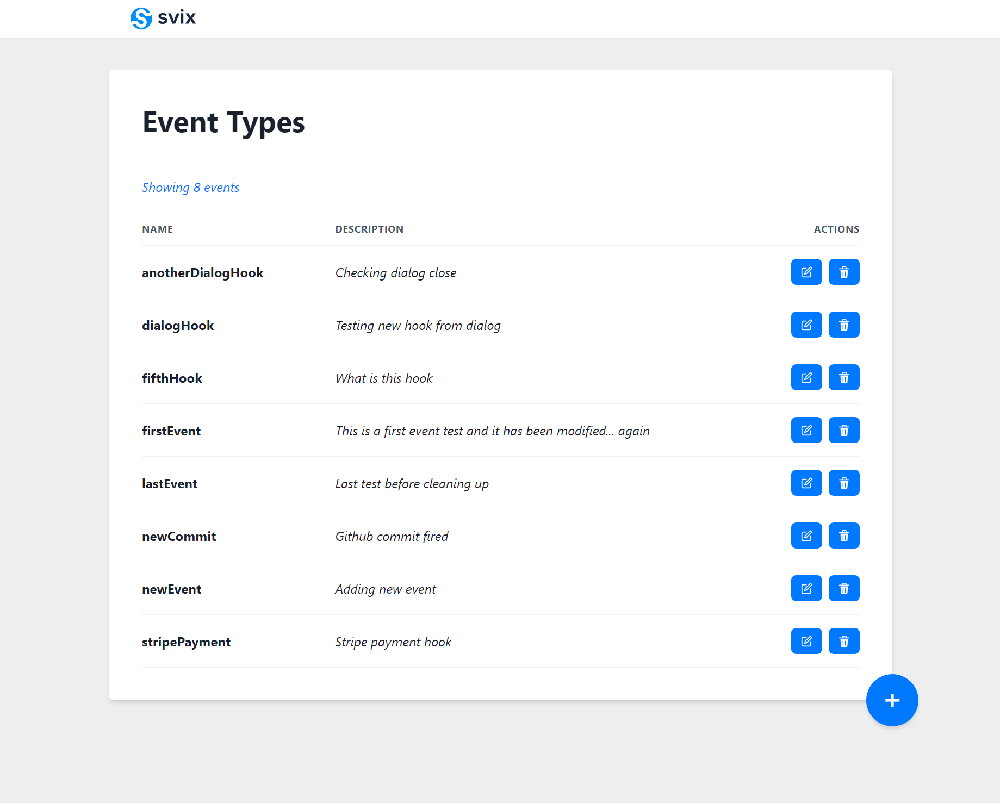
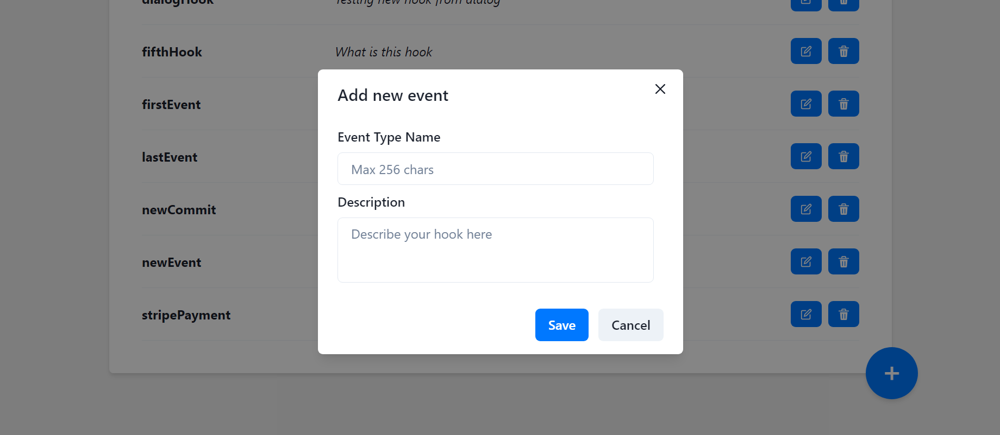
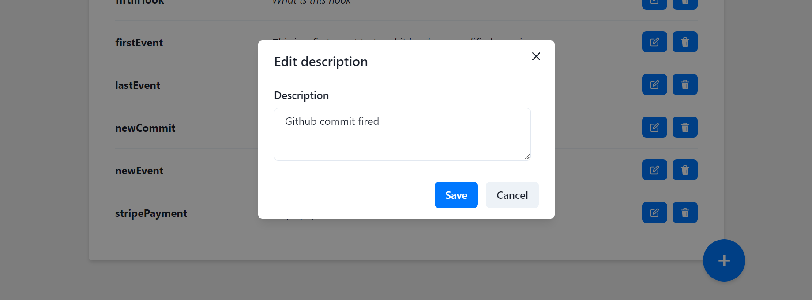
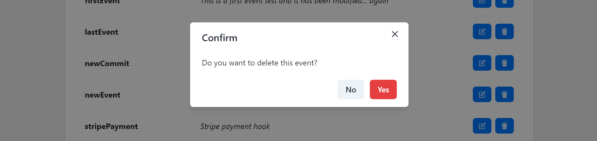

# Svix Manager

> A clean dashboard to manage your [Svix](https://www.svix.com/) webhooks — list, create, edit and delete event types from one place.


**🔗 Live demo: [svix-project.vercel.app](https://svix-project.vercel.app/)**



## Features

- **List** every event type registered in your Svix environment
- **Create** new event types with name and description
- **Edit** an event type's description
- **Delete** event types with a confirmation step
- Single-page UI with dedicated modals for each action

## Tech stack

- **[Next.js](https://nextjs.org/)** — React framework, deployed on Vercel
- **TypeScript** — type-safe components and API layer
- **[Chakra UI](https://chakra-ui.com/)** — accessible component library
- **[Svix](https://www.svix.com/)** — webhooks-as-a-service, accessed through the official `svix` npm client
- **Jest** + **Testing Library** — unit tests

## Getting started

**Requirements:** [Node.js](https://nodejs.org/en/download) and npm.

```sh
git clone https://github.com/juanelfers/svix-project
cd svix-project
npm install
npm run dev
```

Then open [http://localhost:3000](http://localhost:3000).

## Testing

```sh
npm test          # run the test suite
npm run coverage  # run with coverage report
```

## Screenshots

| Create | Edit | Delete |
| :----: | :--: | :----: |
|  |  |  |

## Notes & design decisions

The app started as a Vite + React + TS SPA and was later migrated to Next.js to
keep the door open for server-side features. Chakra UI was chosen because it is
the Svix team's preferred library and needs very little custom CSS to get a
functional, polished result. Everything lives on a single page, with the create,
edit and delete flows handled through three modals.

## Possible improvements

- Pagination on the event-types list (front-end only — the Svix endpoint has none)
- Input validation and error handling
- Responsive / mobile layout
- Expose the remaining event-type attributes (`archived`, `schemas`, `featureFlag`)
- More tests and a TDD-first workflow

## License

[MIT](./LICENSE) © Juan Elfers
