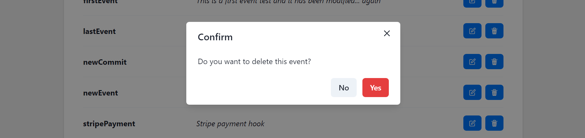

# Svix Manager

[Svix Manager](https://svix-project.vercel.app/) is a dashboard built in NextJS to manage your webhooks using the Svix service.
In this version you will be able to:
* List Event Types
* Create new Event Types
* Update Event Types description
* Delete Event Types

you can try it at: https://svix-project.vercel.app/

# Table of Contents

1. [Requirements](#Requirements)
2. [Installation](#Installation)
4. [Development](#Development)
5. [Project Journey 🚀](#Journey)

# Requirements
* [Node.js](https://nodejs.org/en/download)
* [npm](https://docs.npmjs.com/getting-started)

# Installation
### Clone the repository:
```sh
git clone https://github.com/juanelfers/svix-project
cd svix-project
nom install
```

# Development
```sh
npm run dev
```
Then connect to localhost:3000

# Journey
### Selection of tools
This application runs on a NextJS server and deploys automatically to Vercel

Chakra UI was picked because 
1. it's the preferred UI of the Svix team, because 
2. it's one of the latest libraries for React 
3. it requires minimum CSS adjustments to get a functional and visually appealing application

This application also makes use of the svix npm library to simplify the queries to the Svix API

### Change of plans
Initially, the project was built using the latest version of Vite+React+TS

After finishing a fully functional version, I decided to migrate it to NextJS thinking about the advantages it may offer in a future development.

### Deciding on the fly and fixing styles
Being my first time using Chakra UI, I was tempted to use more features than the ones I actually needed. As there was no design for this application, I iterated over it a couple of times until I managed to get something I liked.

Despite using a well-polished UI, I started to see some details that were a little bit off since the beginning of the development, some common issues with line-height and some elements that didn't line up very well because of some default paddings of the components.

Luckily, newer UI libraries are really easy to customize by just adding some props.

### SPA
For the sake of simplicity, this is so far an SPA. At some point, I added another page to create new event types, but I think it made much more sense to have everything on just one page and it was quite easy to move the page inside of a new modal.
(the app has 3 modals in total: to create, edit and delete event types)

### Final Design:
After some refactor and adjustments on the styles, this is how this manager looks:




## Conclusion
This project gave me the opportunity to practice some of the things I already knew well like NextJS and deploying to Vercel, but it was a nice little challenge to learn a new UI library like Chakra (and a pleasant surprise as well).

I noticed that the Svix API is very user-friendly and I managed to make it work really quickly, reaching the required project functionality in about half an hour

## Future Improvements
the following features and enhancements could be added to this Svix manager:
1. **Pagination**. This was initially proposed but was left for a future version. It is worth mentioning that it would be a functionality entirely handled by the front end, as the Svix API currently does not have pagination on this endpoint
2. **Validation and error handling**. Right now the application has almost no validation for the user inputs and it doesn't handle possible errors. This would be a priority for further development
3. **Mobile**. This is a priority; thinking in different devices while developing is a must, and there are always adjustments we need to do to make it look fine, no matter what kind of screen or device we use. Because it was not a requirement, I decided to leave this for a next iteration
4. **Create and edit event types**. Right now it's only possible to define the name and description of and event type, but the API allows you to set other attributes like "archived", "schemas" and "featureFlag"
5. **Adding more tests and trying to move to a more TDD approach**. Testing is crucial to avoid mistakes during development. Writing useful tests always take time, but they can save you a greater cost
6. **Improved design**: I'm okay with the modals I used, but I think there is a lot of room to improvements, like disabling submit buttons when data is invalid, adding loaders and improving the hierarchy between some elements
